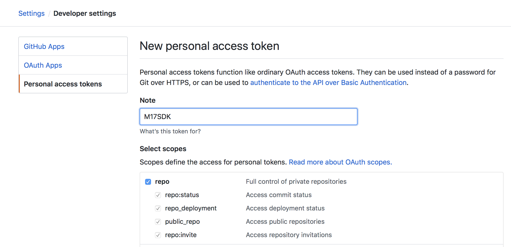
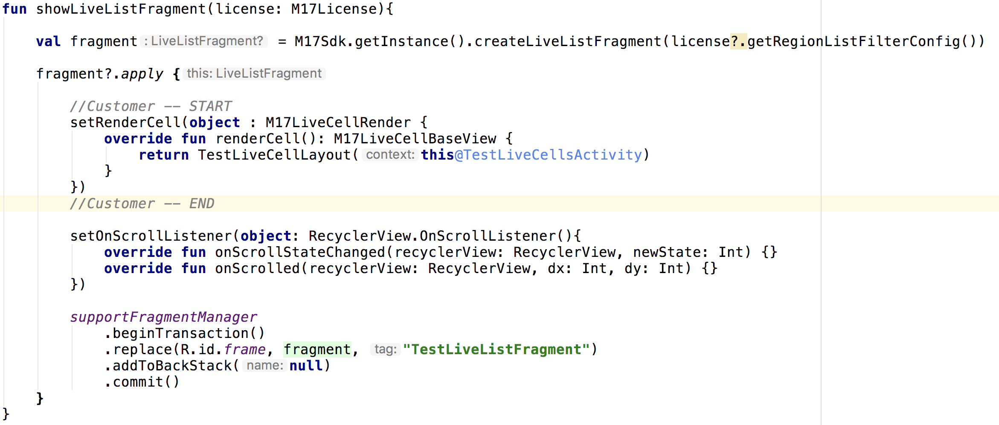
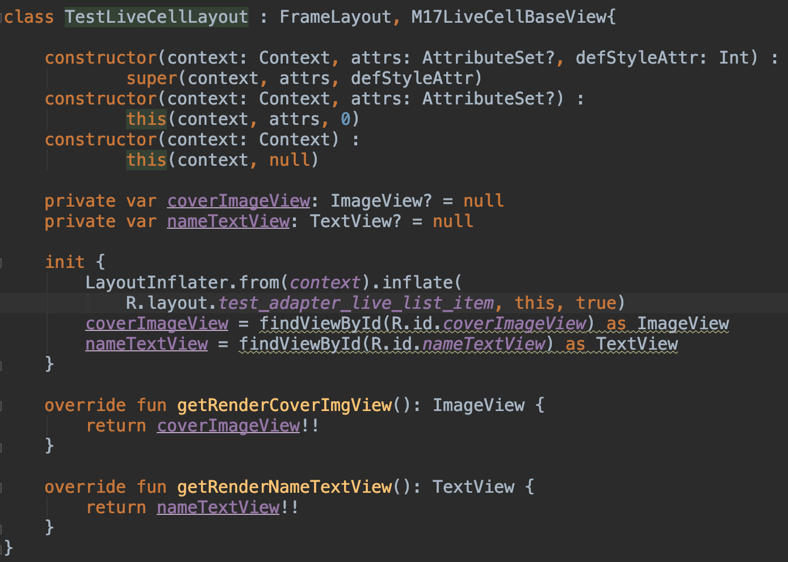

# 17SDK-Android

##Generate your github authorization


##Gradle
###Repositories
```
maven {
    url "https://raw.githubusercontent.com/17media/M17_SDK_Released/master/releases"
    credentials(HttpHeaderCredentials) {
        name = "Authorization"
        value = "Bearer {input your github authorization}"
    }
    authentication {
        header(HttpHeaderAuthentication)
    }
}
```

###DataBinding
```
dataBinding {
   enabled = true
}
```

###Dependencies
```
//M17SDK
implementation "com.machipopo.media17:sdk:1.0.3"

//Kotlin
implementation "org.jetbrains.kotlin:kotlin-stdlib-jdk8:$kotlin_version"

//Android X
implementation 'androidx.appcompat:appcompat:1.1.0'
implementation 'androidx.core:core-ktx:1.1.0'

//Gson
implementation "com.google.code.gson:gson:$gson_version"

//Koin
implementation "org.koin:koin-android:$koin"
implementation "org.koin:koin-androidx-scope:$koin"
implementation "org.koin:koin-androidx-viewmodel:$koin"

//Retrofit
implementation "com.squareup.okhttp3:okhttp:$okhttp"
implementation "com.squareup.okhttp3:logging-interceptor:$loggingInterceptor"
implementation "com.squareup.retrofit2:retrofit:$retrofit"
implementation "com.squareup.retrofit2:adapter-rxjava2:$retrofit"
implementation "com.squareup.retrofit2:converter-gson:$retrofit"
implementation "ren.yale.android:retrofitcachelibrx2:$retrofitcachelibrx2"

//RxJava
implementation "io.reactivex.rxjava2:rxjava:$rxJava"
implementation "io.reactivex.rxjava2:rxkotlin:$rxKotlin"
implementation "io.reactivex.rxjava2:rxandroid:$rxAndroid"
implementation "com.jakewharton.rxbinding2:rxbinding:$rxBinding"
implementation "org.jetbrains.kotlin:kotlin-reflect:$kotlin_version"

//Timber
implementation "com.jakewharton.timber:timber:$timber"

//Glide
implementation "jp.wasabeef:glide-transformations:$glide_transformations"
implementation "com.github.bumptech.glide:glide:$glide_version"
implementation "com.github.bumptech.glide:okhttp3-integration:$glide_version"
implementation("com.github.bumptech.glide:recyclerview-integration:$glide_version") {
    transitive = false
}

//Paging
implementation "androidx.paging:paging-runtime-ktx:$paging_version"
implementation "androidx.paging:paging-rxjava2:$paging_version"
```

##Application
###SDK Init
```
override fun onCreate() {
   super.onCreate()
   M17Sdk.getInstance().initSdk(this)
}
```

###Class Reference
 - (Class) M17LiveListConfig - To create the configuration for live list fragment.
 - (Interface) M17LiveCellBaseView - The view has to confirm this interface to implement in your custom live cell layout.

###How to get the live list Fragment


###How to implement your own live cell layout


##Run your project


